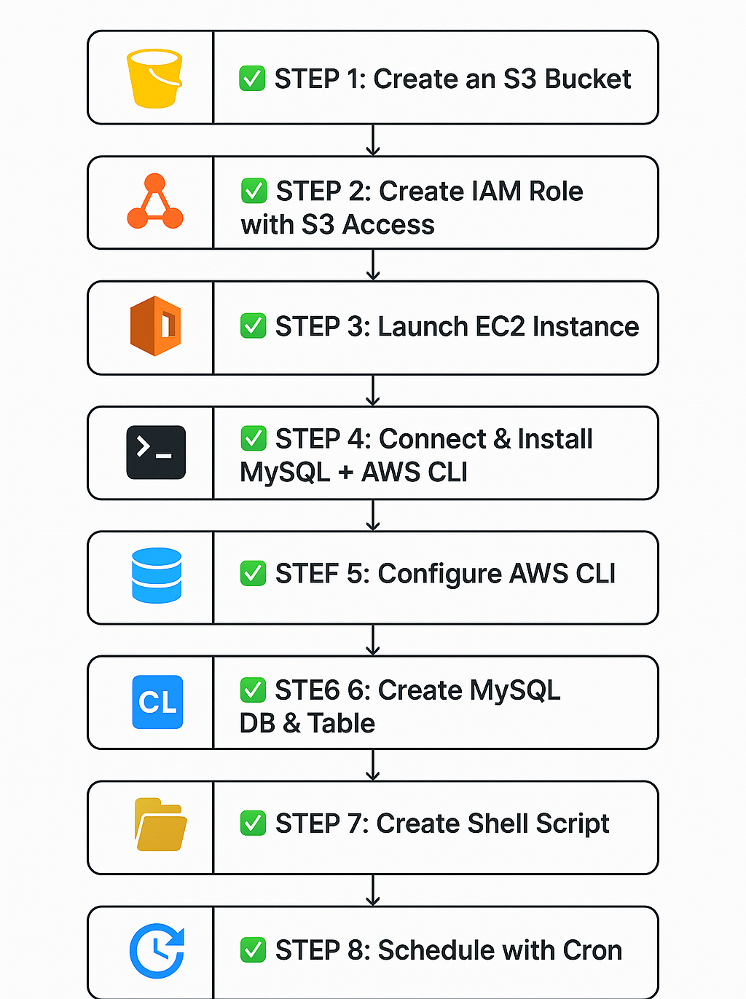
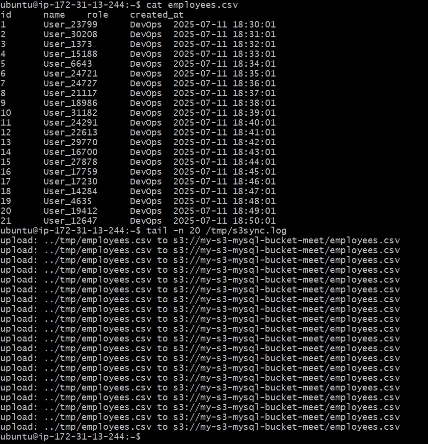
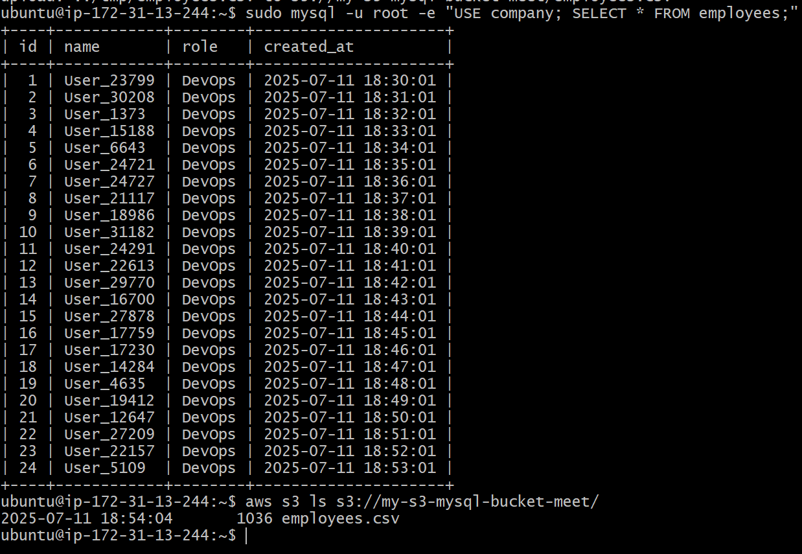

# 📦 MySQL to S3 Automation via EC2 & Cron



Automated backup of a MySQL database from an EC2 instance to an S3 bucket using a cron job.

---

## ✅ STEP 1: Create an S3 Bucket

### 🛠️ Using AWS Console

1. Go to **S3** service
2. Click **Create bucket**
3. Set:
   - Bucket name: `my-s3-mysql-bucket`
   - Region: Same as EC2 instance
4. Click **Create bucket**

---

## ✅ STEP 2: Create IAM Role with S3 Access

### 🛠️ Create IAM Role for EC2

1. Go to **IAM > Roles**
2. Click **Create role**
3. Trusted Entity: **AWS Service → EC2**
4. Attach policy: `AmazonS3FullAccess` or custom policy:

```json
{
  "Version": "2012-10-17",
  "Statement": [
    {
      "Effect": "Allow",
      "Action": ["s3:PutObject", "s3:GetObject", "s3:ListBucket"],
      "Resource": [
        "arn:aws:s3:::mysql-minute-backup-meet",
        "arn:aws:s3:::mysql-minute-backup-meet/*"
      ]
    }
  ]
}
```

5. Name: `EC2-S3-MysqlAccess-Role`
6. Click **Create Role**

---

## ✅ STEP 3: Launch EC2 Instance

Go to **EC2 > Instances**

- Name: `mysql-s3-instance`
- OS: **Ubuntu 22.04**
- Instance type: `t2.micro`
- Key pair: Create/download one
- IAM Role: `EC2-S3-MysqlAccess-Role`

---

## ✅ STEP 4: Connect & Install MySQL + AWS CLI

```bash
ssh -i my-key.pem ubuntu@<EC2_PUBLIC_IP>
sudo apt update
sudo apt install mysql-server awscli -y
sudo systemctl start mysql
sudo systemctl enable mysql
```

---

## ✅ STEP 5: Configure AWS CLI

```bash
aws configure
```

---

## ✅ STEP 6: Create MySQL DB & Table

```bash
sudo mysql
```

Inside MySQL shell:

```sql
CREATE DATABASE testdb;
USE testdb;
CREATE TABLE users (
  id INT AUTO_INCREMENT PRIMARY KEY,
  name VARCHAR(50),
  created_at DATETIME DEFAULT CURRENT_TIMESTAMP
);
EXIT;
```

---

## ✅ STEP 7: Create Shell Script

📁 File: `/home/ubuntu/s3_mysql_sync.sh`

```bash
#!/bin/bash

DB_NAME="testdb"
TABLE_NAME="users"
BUCKET_NAME="mysql-minute-backup-meet"
BACKUP_FILE="/tmp/${DB_NAME}_$(date +%F_%H-%M-%S).sql"

# Insert dynamic data into DB
mysql -u root -e "USE ${DB_NAME}; INSERT INTO ${TABLE_NAME} (name) VALUES ('User_$(date +%s)');"

# Dump the database
mysqldump -u root ${DB_NAME} > $BACKUP_FILE

# Upload to S3
aws s3 cp $BACKUP_FILE s3://${BUCKET_NAME}/

# Clean up
rm $BACKUP_FILE
```

Make it executable:

```bash
chmod +x /home/ubuntu/s3_mysql_sync.sh
```

---

## ✅ STEP 8: Schedule with Cron

```bash
crontab -e
```

Add the job:

```cron
* * * * * /home/ubuntu/s3_mysql_sync.sh
```

---

## ✅ Validate Backup

```bash
aws s3 ls s3://mysql-minute-backup-meet/ --recursive
```

Check table data:

```bash
sudo mysql -e "SELECT * FROM testdb.users;"
```

---




